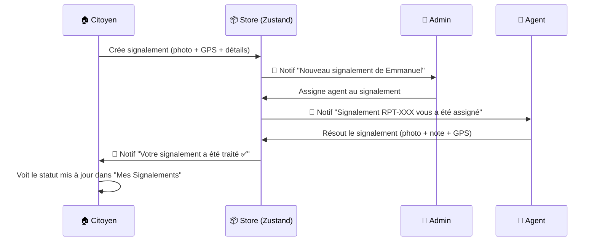

# Prototype Réaliste AMOGED-D4 — Plan d'Implémentation

Transformer le MVP en prototype réaliste où **chaque action produit un effet visible** : les signalements créés par les citoyens apparaissent dans le dashboard admin, les agents gèrent les interventions avec photos/localisation, les notifications sont ciblées par utilisateur, et le calendrier de collecte se synchronise entre admin et citoyen.

---

## Résumé des changements

| # | Tâche | Fichiers |
|---|-------|----------|
| 1 | **Store centralisé signalements** | `useReportStore.ts` [NEW] |
| 2 | **Store centralisé plannings** | `useScheduleStore.ts` [NEW] |
| 3 | **Notifications ciblées par userId** | `useAppStore.ts` [MODIFY] |
| 4 | **ReportForm → enregistre dans le store** | `ReportForm.tsx` [MODIFY] |
| 5 | **MyReportsPage → lit le store** | `MyReportsPage.tsx` [MODIFY] |
| 6 | **CitizenHome → lit le store** | `CitizenHome.tsx` [MODIFY] |
| 7 | **Notifications citoyen filtrées** | `NotificationsPage.tsx` [MODIFY] |
| 8 | **Admin ReportsPage → lit le store + workflow** | `ReportsPage.tsx` [MODIFY] |
| 9 | **Admin Dashboard → stats dynamiques** | `AdminDashboard.tsx` [MODIFY] |
| 10 | **Admin Notifications filtrées** | `AdminNotificationsPage.tsx` [MODIFY] |
| 11 | **Page Agent : Mes Missions** | `AgentMissionsPage.tsx` [NEW] |
| 12 | **Sidebar conditionnelle (Agent vs Admin)** | `AdminSidebar.tsx` [MODIFY] |
| 13 | **Routing agent** | `App.tsx` [MODIFY] |
| 14 | **CalendarPage → lit le store planning** | `CalendarPage.tsx` [MODIFY] |
| 15 | **Supprimer démo du login** | `LoginPage.tsx` [MODIFY] |
| 16 | **README professionnel** | `README.md` [NEW] |
| 17 | **Dockerfile + nginx + .dockerignore** | `Dockerfile`, `nginx.conf`, `.dockerignore` [NEW] |

---

## Proposed Changes

### 1. Report Store — Store centralisé des signalements

#### [NEW] [useReportStore.ts](file:///e:/Mes%20projets/amoged-d4-waste-management-mvp/src/store/useReportStore.ts)

Zustand store **persisté en localStorage** :

- **State** : `reports: Report[]` (initialisé avec `MOCK_REPORTS`)
- **Actions** :
  - `addReport(data)` — génère un id unique, referenceNumber auto-incrémenté, timeline initiale, ajoute en tête
  - `updateReportStatus(id, status, agentNote?, photo?)` — met à jour le statut + ajoute un événement timeline
  - `assignAgent(reportId, agentId, agentName)` — change le statut à `ASSIGNED`, ajoute la timeline
  - `resolveReport(reportId, agentId, agentName, note, photo?, location?)` — marque `RESOLVED`, ajoute timeline avec photo

> [!IMPORTANT]
> Ce store remplace `MOCK_REPORTS` dans toutes les pages. Les 500 rapports mock sont chargés à l'init, les nouveaux créés dynamiquement s'ajoutent par dessus.

---

### 2. Schedule Store — Store centralisé des plannings

#### [NEW] [useScheduleStore.ts](file:///e:/Mes%20projets/amoged-d4-waste-management-mvp/src/store/useScheduleStore.ts)

Zustand store **persisté** :

- **State** : `schedules: CollectionSchedule[]` (initialisé avec `MOCK_SCHEDULES`)
- **Actions** :
  - `updateSchedule(id, data)` — modifie un planning existant (jours, horaires)
  - `addSchedule(data)` — ajoute un nouveau planning

> Les changements faits côté admin dans les paramètres de planning seront visibles instantanément côté citoyen dans le calendrier.

---

### 3. Notifications ciblées par `userId`

#### [MODIFY] [useAppStore.ts](file:///e:/Mes%20projets/amoged-d4-waste-management-mvp/src/store/useAppStore.ts)

**Problème actuel** : Toutes les notifications sont visibles par tout le monde, `unreadCount` est global.

**Changements** :
- `addNotification` reste identique (stocke avec `userId`)
- Ajouter un helper `getNotificationsForUser(userId)` qui filtre par `userId`
- Ajouter un helper `getUnreadCountForUser(userId)` qui calcule le nombre de non-lues pour un utilisateur spécifique
- Les pages de notifications appelleront ces fonctions filtrées

**Flux de notifications** :
```
🏠 Citoyen crée signalement → 🔔 Notif pour admin-001 ("Nouveau signalement de X")
👑 Admin assigne agent → 🔔 Notif pour agent-XXX ("Signalement RPT-XXX vous a été assigné")
👷 Agent résout le signalement → 🔔 Notif pour citizen-XXX ("Votre signalement a été traité ✅")
❌ Admin rejette le signalement → 🔔 Notif pour citizen-XXX ("Signalement rejeté")
```

---

### 4. ReportForm — Intégration store

#### [MODIFY] [ReportForm.tsx](file:///e:/Mes%20projets/amoged-d4-waste-management-mvp/src/pages/citizen/ReportForm.tsx)

- Importer `useReportStore`
- Dans `handleSubmit` : appeler `addReport()` avec **toutes** les données (photos base64, localisation GPS, catégorie, urgence, titre, description, zone du citoyen)
- Le toast affiche le **vrai** numéro de référence généré dynamiquement
- Envoyer une notification ciblée à `admin-001` : `"Nouveau signalement de {user.fullName}"`

---

### 5. MyReportsPage — Lecture store

#### [MODIFY] [MyReportsPage.tsx](file:///e:/Mes%20projets/amoged-d4-waste-management-mvp/src/pages/citizen/MyReportsPage.tsx)

- Remplacer `MOCK_REPORTS` par `useReportStore().reports`
- Filtrer par `citizenId === user.id`
- Les rapports créés + les mises à jour de statut (par l'agent) apparaissent en temps réel

---

### 6. CitizenHome — Lecture store

#### [MODIFY] [CitizenHome.tsx](file:///e:/Mes%20projets/amoged-d4-waste-management-mvp/src/pages/citizen/CitizenHome.tsx)

- Remplacer `MOCK_REPORTS` et `MOCK_NOTIFICATIONS` par les données des stores
- Stats calculées dynamiquement à partir des signalements réels du citoyen
- Notifications filtrées par `userId === user.id`

---

### 7. Notifications citoyen filtrées

#### [MODIFY] [NotificationsPage.tsx](file:///e:/Mes%20projets/amoged-d4-waste-management-mvp/src/pages/citizen/NotificationsPage.tsx)

- Filtrer `notifications` par `userId === user.id` au lieu de `slice(0, 30)`
- Le citoyen ne voit **que ses propres notifications** :
  - ✅ "Signalement enregistré"
  - 👷 "Agent assigné à votre signalement"
  - 🎉 "Signalement résolu"
  - ❌ "Signalement rejeté"
  - 🎁 "Récompense validée/refusée"

---

### 8. Admin ReportsPage — Workflow complet

#### [MODIFY] [ReportsPage.tsx](file:///e:/Mes%20projets/amoged-d4-waste-management-mvp/src/pages/admin/ReportsPage.tsx)

- Remplacer `useState(MOCK_REPORTS)` par `useReportStore()`
- **Assigner un agent** → appelle `store.assignAgent()` + envoie notif à l'agent ciblé
- **Changer statut** → appelle `store.updateReportStatus()` + envoie notif au citoyen

---

### 9. Admin Dashboard — Stats dynamiques

#### [MODIFY] [AdminDashboard.tsx](file:///e:/Mes%20projets/amoged-d4-waste-management-mvp/src/pages/admin/AdminDashboard.tsx)

- Lire `useReportStore().reports` pour les signalements récents (triés par `createdAt` desc)
- Recalculer les KPI cards dynamiquement depuis le store :
  - Total signalements = `reports.length`
  - Résolus = `reports.filter(r => r.status === 'RESOLVED').length`
  - En attente = `reports.filter(r => r.status === 'PENDING').length`
- Quand un citoyen crée un signalement → il apparaît immédiatement dans "Signalements Récents"

---

### 10. Admin Notifications filtrées

#### [MODIFY] [AdminNotificationsPage.tsx](file:///e:/Mes%20projets/amoged-d4-waste-management-mvp/src/pages/admin/AdminNotificationsPage.tsx)

- Filtrer par `userId === 'admin-001'` (ou par le user connecté admin/superviseur)
- L'admin ne voit que :
  - 📋 "Nouveau signalement de [citoyen]"
  - 🎁 "Nouvelle demande de récompense"
  - ⚠️ Alertes système

---

### 11. Page Agent : Mes Missions

#### [NEW] [AgentMissionsPage.tsx](file:///e:/Mes%20projets/amoged-d4-waste-management-mvp/src/pages/admin/AgentMissionsPage.tsx)

Page visible **uniquement pour le rôle AGENT** dans la sidebar. L'agent voit :

1. **Liste des signalements assignés** (filtrés par `assignedAgentId === user.id`)
2. Pour chaque signalement assigné, un bouton **"Traiter"** qui ouvre un modal avec :
   - 📸 Prise de photo (preuve d'intervention)
   - 📍 Localisation GPS actuelle
   - 📝 Note de résolution
   - Bouton **"Marquer comme Résolu"**
3. Quand l'agent résout → `store.resolveReport()` + notification au citoyen
4. L'agent peut aussi voir ses signalements **déjà traités** (historique)

> [!IMPORTANT]
> L'agent a une vue simplifiée. Il ne voit pas le dashboard complet ni les pages admin (users, audit, etc.). Le menu sidebar est conditionnel.

---

### 12. Sidebar conditionnelle

#### [MODIFY] [AdminSidebar.tsx](file:///e:/Mes%20projets/amoged-d4-waste-management-mvp/src/components/layout/AdminSidebar.tsx)

**Si `user.role === 'AGENT'`** : montrer uniquement :
- 📋 Mes Missions (nouveau)
- 🔔 Notifications
- ⚙️ Paramètres

**Si `user.role === 'ADMIN' ou 'SUPERVISOR'`** : montrer le menu complet actuel

---

### 13. Routing Agent

#### [MODIFY] [App.tsx](file:///e:/Mes%20projets/amoged-d4-waste-management-mvp/src/App.tsx)

- Ajouter la route `/admin/missions` → `<AgentMissionsPage />`
- L'agent sera redirigé vers `/admin/missions` au lieu de `/admin/dashboard` après login

---

### 14. CalendarPage — Lecture store planning

#### [MODIFY] [CalendarPage.tsx](file:///e:/Mes%20projets/amoged-d4-waste-management-mvp/src/pages/citizen/CalendarPage.tsx)

- Remplacer `MOCK_SCHEDULES` par `useScheduleStore().schedules`
- Si l'admin modifie les jours/horaires de collecte → le citoyen voit la mise à jour dans son calendrier

---

### 15. Login — Supprimer la section démo

#### [MODIFY] [LoginPage.tsx](file:///e:/Mes%20projets/amoged-d4-waste-management-mvp/src/pages/auth/LoginPage.tsx)

- **Commenter** toute la section "DÉMO RAPIDE" (divider + grille des 4 boutons)
- Commenter `handleDemoLogin` et le tableau `DEMO_ACCOUNTS`
- Le login fonctionne uniquement par email/password
- Les identifiants sont documentés dans le README

---

### 16. README professionnel

#### [NEW] [README.md](file:///e:/Mes%20projets/amoged-d4-waste-management-mvp/README.md)

Contenu structuré :
- 🏗️ **Présentation** : AMOGED-D4, plateforme de gestion des déchets pour Douala 4ème
- ✨ **Fonctionnalités** : signalements, dashboard, interventions agent, récompenses, notifications ciblées, calendrier
- 🏛️ **Architecture** : React 19 + Vite + TypeScript + Zustand + TailwindCSS + Leaflet + Recharts
- 🔐 **Identifiants de connexion** :

| Rôle | Email | Mot de passe |
|------|-------|--------------|
| Administrateur | `admin@amoged-d4.cm` | `Admin@2025` |
| Superviseur | `supervisor1@amoged-d4.cm` | `Supervisor@2025` |
| Agent terrain | `agent1@amoged-d4.cm` | `Agent@2025` |
| Citoyen | `emmanuel.ngono0@gmail.com` | `Citizen@2025` |

- 🚀 **Démarrage** : npm + Docker
- 📁 **Structure du projet**

---

### 17. Dockerfile

#### [NEW] [Dockerfile](file:///e:/Mes%20projets/amoged-d4-waste-management-mvp/Dockerfile)
#### [NEW] [nginx.conf](file:///e:/Mes%20projets/amoged-d4-waste-management-mvp/nginx.conf)
#### [NEW] [.dockerignore](file:///e:/Mes%20projets/amoged-d4-waste-management-mvp/.dockerignore)

- Multi-stage build :
  1. **Stage 1** : `node:20-alpine` → installe deps + build
  2. **Stage 2** : `nginx:alpine` → copie le build, sert sur le port 80
- `nginx.conf` avec `try_files` pour le SPA routing
- Commandes :
  ```bash
  docker build -t amoged-d4 .
  docker run -p 3000:80 amoged-d4
  ```

---

## Flux Complet (Scénario réaliste)



---

## Verification Plan

### Automated Tests
1. `npm run build` — compilation sans erreur
2. Test navigateur complet :
   - ✅ Citoyen → Créer signalement → Vérifier dans "Mes Signalements"
   - ✅ Admin → Voir le signalement dans le dashboard → Assigner agent
   - ✅ Agent → Voir la mission → Traiter avec photo → Marquer résolu
   - ✅ Citoyen → Recevoir la notification → Voir le statut "Résolu"
   - ✅ Vérifier que les notifications sont **séparées par rôle**
   - ✅ Vérifier que le calendrier reflète les plannings du store
   - ✅ Vérifier que la page de login n'a plus de boutons démo
